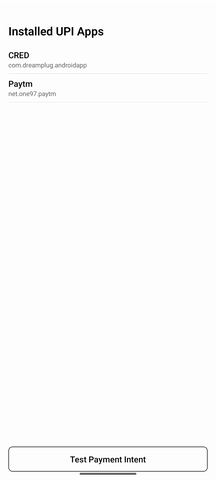
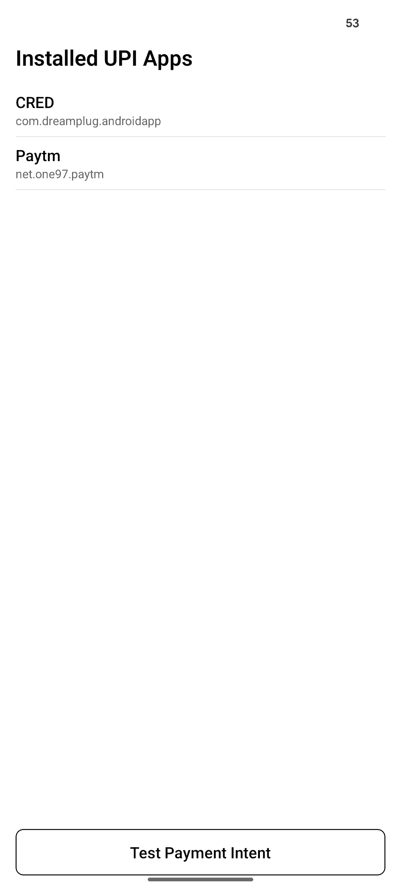
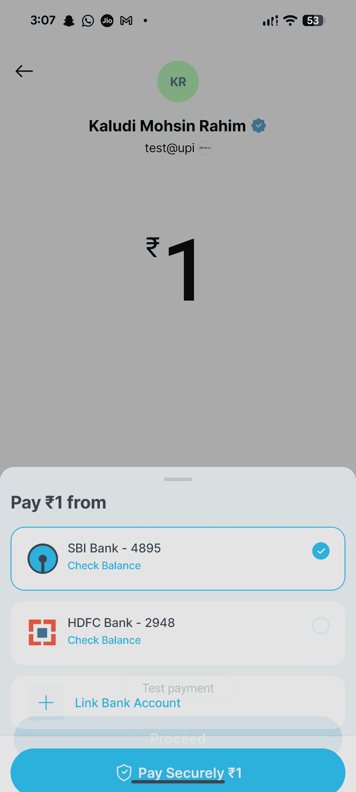
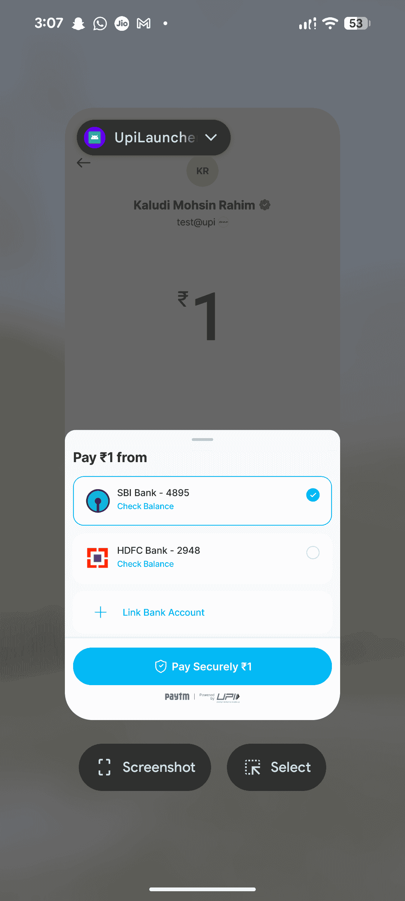

[](https://www.npmjs.com/package/react-native-upi-launcher)
[](https://www.npmjs.com/package/react-native-upi-launcher)
[](https://opensource.org/licenses/MIT)
[](https://www.android.com)

# 🚀 React Native UPI Launcher

**The simplest way to integrate UPI payments in your React Native Android app** — Launch UPI apps (PhonePe, Google Pay, Paytm, BHIM) directly or via chooser, and fetch installed UPI apps on user's device.



## ✨ Why Choose react-native-upi-launcher?

- 🎯 **Direct UPI App Launch** — Open specific payment apps (PhonePe, GPay, Paytm) directly
- 🔄 **Smart Fallback** — Automatically shows chooser if preferred app isn't available
- 📱 **Detect Installed Apps** — Get list of all UPI-enabled apps on device
- ⚡ **Lightweight** — Zero dependencies, minimal footprint
- 🛡️ **Type-Safe** — Full TypeScript support
- 🔌 **Easy Integration** — Works with React Native 0.60+ with auto-linking

## 📸 Screenshots

<table>
  <tr>
    <td></td>
    <td></td>
    <td></td>
  </tr>
</table>

## 🎯 Use Cases

- **E-commerce apps** — Accept UPI payments seamlessly
- **Bill payment apps** — Quick utility bill settlements
- **Peer-to-peer payment apps** — Send money to friends
- **Subscription services** — Recurring UPI payments
- **Donation platforms** — Accept contributions via UPI

## 📦 Installation

### NPM

```bash
npm install react-native-upi-launcher
```

### Yarn

```bash
yarn add react-native-upi-launcher
```

### For React Native < 0.60

```bash
react-native link react-native-upi-launcher
```

## 🚀 Quick Start

### 1. Fetch Installed UPI Apps

```javascript
import { fetchUpiApps } from "react-native-upi-launcher";

const getAvailableUpiApps = async () => {
  try {
    const apps = await fetchUpiApps();
    console.log("Available UPI apps:", apps);
    /*
    Output example:
    [
      { packageName: "com.phonepe.app", appName: "PhonePe" },
      { packageName: "com.google.android.apps.nbu.paisa.user", appName: "Google Pay" },
      { packageName: "net.one97.paytm", appName: "Paytm" }
    ]
    */
  } catch (error) {
    console.error("Error fetching UPI apps:", error);
  }
};
```

### 2. Launch UPI Payment Intent

```javascript
import { openUpiIntent } from "react-native-upi-launcher";

const makePayment = async () => {
  const upiUrl =
    "upi://pay?pa=merchant@upi&pn=Merchant%20Name&am=100&cu=INR&tn=Order%20Payment";
  const preferredApp = "com.phonepe.app"; // Optional: specific UPI app package

  try {
    const result = await openUpiIntent(upiUrl, preferredApp);
    console.log("Payment initiated:", result);
  } catch (error) {
    console.error("Payment failed:", error);
  }
};
```

### 3. Complete Example with Error Handling

```javascript
import React, { useState, useEffect } from "react";
import { View, Button, FlatList, Text, Alert } from "react-native";
import { fetchUpiApps, openUpiIntent } from "react-native-upi-launcher";

const PaymentScreen = () => {
  const [upiApps, setUpiApps] = useState([]);

  useEffect(() => {
    loadUpiApps();
  }, []);

  const loadUpiApps = async () => {
    try {
      const apps = await fetchUpiApps();
      setUpiApps(apps);
    } catch (error) {
      Alert.alert("Error", "Failed to load UPI apps");
    }
  };

  const initiatePayment = async (packageName) => {
    const upiUrl =
      "upi://pay?pa=test@upi&pn=Test%20User&am=1&cu=INR&tn=Test%20Payment";

    try {
      await openUpiIntent(upiUrl, packageName);
      Alert.alert("Success", "Payment initiated successfully");
    } catch (error) {
      Alert.alert("Error", "Payment failed: " + error.message);
    }
  };

  return (
    <View>
      <FlatList
        data={upiApps}
        keyExtractor={(item) => item.packageName}
        renderItem={({ item }) => (
          <Button
            title={`Pay with ${item.appName}`}
            onPress={() => initiatePayment(item.packageName)}
          />
        )}
      />
    </View>
  );
};

export default PaymentScreen;
```

## 📋 API Reference

### `fetchUpiApps(): Promise<UpiApp[]>`

Fetches all installed UPI applications on the device.

**Returns:** Array of UPI app objects

```typescript
interface UpiApp {
  packageName: string; // e.g., "com.phonepe.app"
  appName: string; // e.g., "PhonePe"
}
```

### `openUpiIntent(upiUrl: string, packageName?: string): Promise<void>`

Launches UPI payment intent.

**Parameters:**

- `upiUrl` (required): UPI payment URL string
- `packageName` (optional): Specific UPI app package name. If omitted or app not found, shows chooser.

**UPI URL Format:**

```
upi://pay?pa=<UPI_ID>&pn=<NAME>&am=<AMOUNT>&cu=<CURRENCY>&tn=<NOTE>
```

**Parameters:**

- `pa` — Payee UPI address (required)
- `pn` — Payee name (required)
- `am` — Amount (optional)
- `cu` — Currency (default: INR)
- `tn` — Transaction note (optional)

## 📱 Popular UPI App Package Names

| App            | Package Name                             |
| -------------- | ---------------------------------------- |
| **PhonePe**    | `com.phonepe.app`                        |
| **Google Pay** | `com.google.android.apps.nbu.paisa.user` |
| **Paytm**      | `net.one97.paytm`                        |
| **BHIM**       | `in.org.npci.upiapp`                     |
| **Amazon Pay** | `in.amazon.mShop.android.shopping`       |
| **WhatsApp**   | `com.whatsapp`                           |
| **Mobikwik**   | `com.mobikwik_new`                       |
| **Freecharge** | `com.freecharge.android`                 |

## ⚙️ Configuration

### Adding Support for Additional UPI Apps

If you need to support UPI apps beyond the default list, add their package names to your `AndroidManifest.xml`:

```xml
<manifest xmlns:android="http://schemas.android.com/apk/res/android"
    package="com.yourapp">

    <queries>
        <!-- Default UPI apps (already included in library) -->
        <package android:name="com.phonepe.app" />
        <package android:name="com.google.android.apps.nbu.paisa.user" />
        <package android:name="net.one97.paytm" />
        <package android:name="in.org.npci.upiapp" />

        <!-- Add your custom UPI apps here -->
        <package android:name="com.mybank.upi" />
        <package android:name="com.customwallet.app" />
    </queries>

    <application>
        <!-- Your app configuration -->
    </application>
</manifest>
```

**Note:** For Android 11+ (API 30+), you must declare package visibility queries in your manifest for apps you want to detect.

## 🔧 Troubleshooting

### Common Issues

**1. No UPI apps detected**

- Ensure UPI apps are installed on the device
- Check `AndroidManifest.xml` has proper `<queries>` declarations
- Verify targetSdkVersion is 30 or higher

**2. App chooser not showing**

- Verify the UPI URL format is correct
- Check that at least one UPI app is installed
- Ensure proper permissions in AndroidManifest

**3. Payment not initiating**

- Validate UPI URL parameters
- Check network connectivity
- Verify UPI app is up to date

## 🍎 iOS Support

On iOS, the library falls back to using React Native's `Linking.openURL()` to open UPI deep links. However, iOS has limited native UPI support compared to Android.

```javascript
import { Linking, Platform } from "react-native";
import { openUpiIntent } from "react-native-upi-launcher";

const handlePayment = async (upiUrl) => {
  if (Platform.OS === "ios") {
    // iOS fallback
    await Linking.openURL(upiUrl);
  } else {
    // Android - full functionality
    await openUpiIntent(upiUrl);
  }
};
```

## 🔐 Security Best Practices

- ✅ Always validate UPI URLs on your backend
- ✅ Never hardcode sensitive payment information
- ✅ Implement proper error handling
- ✅ Verify transaction status via server callbacks
- ✅ Use HTTPS for all API communications
- ✅ Sanitize user inputs before creating UPI URLs

## 🧪 Testing

Test with these sample UPI URLs:

```javascript
// Test payment (will fail gracefully)
const testUrl =
  "upi://pay?pa=test@paytm&pn=Test%20Merchant&am=1&cu=INR&tn=Test";

// Use your own UPI ID for testing
const realUrl = "upi://pay?pa=yourname@paytm&pn=Your%20Name&am=10&cu=INR";
```

## 📊 Performance

- **Bundle size:** < 15KB
- **No external dependencies**
- **Native Android implementation** for optimal performance
- **Async/await support** for modern JavaScript

## 🤝 Contributing

We welcome contributions! Please see our [Contributing Guide](CONTRIBUTING.md) for details.

### Development Workflow

1. Fork the repository
2. Create your feature branch: `git checkout -b feature/amazing-feature`
3. Commit your changes: `git commit -m 'Add amazing feature'`
4. Push to the branch: `git push origin feature/amazing-feature`
5. Open a Pull Request

See detailed [development workflow](CONTRIBUTING.md#development-workflow) guide.

## 📝 Code of Conduct

Please read our [Code of Conduct](CODE_OF_CONDUCT.md) before contributing.

## 📄 License

MIT © Vivek Negi

See [LICENSE](LICENSE) file for details.

## 🙏 Acknowledgments

- Built with [create-react-native-library](https://github.com/callstack/react-native-builder-bob)
- Inspired by the Indian digital payment ecosystem

## 🔗 Links

- **NPM Package:** [npmjs.com/package/react-native-upi-launcher](https://www.npmjs.com/package/react-native-upi-launcher)
- **GitHub:** [github.com/vivnegi21/react-native-upi-launcher](https://github.com/vivnegi21/react-native-upi-launcher)
- **Issues:** [github.com/vivnegi21/react-native-upi-launcher/issues](https://github.com/vivnegi21/react-native-upi-launcher/issues)
- **Changelog:** [CHANGELOG.md](CHANGELOG.md)

## 📈 Stats


---

**Keywords:** react-native, upi, payment, phonepe, gpay, paytm, bhim, android, upi-payment, react-native-payments, indian-payments, upi-integration, mobile-payments, digital-payments, upi-launcher

**Made with ❤️ for the React Native community**
